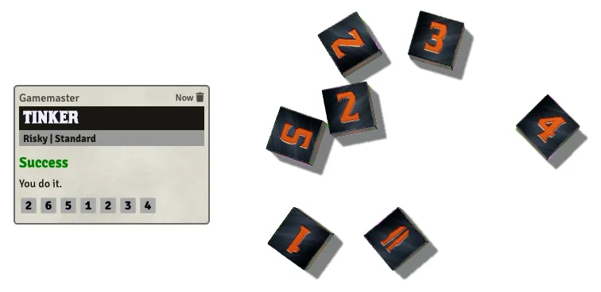

# Dice in the Dark - A Dice So Nice preset.
Now your scoundrels can roll in style! This UNOFFICIAL module adds a preset to [Dice So Nice](https://foundryvtt.com/packages/dice-so-nice/) that replaces the 6 with the iconic blade from the logo of John Harper's Blades in the Dark.

# Usage
* Install the Dice So Nice module and this module.
    * If necessary, you can use the manifest url `https://github.com/zxaos/dice-in-the-dark/releases/latest/download/module.json`
* In the configuration for Dice So Nice, select the "Dice in the Dark" preset for the D6 or for all of the dice!

# License
This module uses the font Kirsty by Larabie Fonts, under the Larabie Fonts Freeware Fonts EULA.

This work is based on Blades in the Dark (found at http://www.bladesinthedark.com/), product of One Seven Design, developed and authored by John Harper, and licensed for use under the Creative Commons Attribution 3.0 Unported license (http://creativecommons.org/licenses/by/3.0/). The Blades in the Dark logo is used with permission.

Blades in the Dark™ is a trademark of One Seven Design.

This module is provided under the MIT License. However, derivative works may need to obtain separate permission to use the included fonts or the Blades in the Dark logo to comply with their terms.
